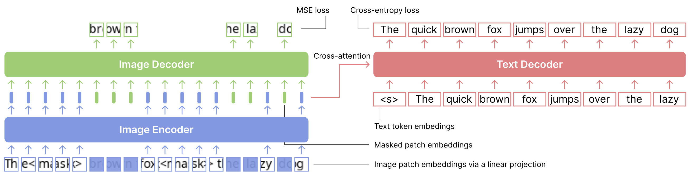

# Improving Language Understanding from Screenshots

This repository contains the code, data, and models for paper [Improving Language Understanding from Screenshots](https://arxiv.org/abs/2402.14073). In this paper, we focus on improving the language understanding ability of "screenshot LM" (models that process everything -- including text -- within visual inputs) and propose patch-and-text prediction (PTP), a novel pre-training objective for screenshot LMs. 




## Quick Links

  - [Environment](#environment)
  - [Preparing the data](#preparing-the-data)
  - [Reproducing our pre-trained models](#reproducing-our-pre-trained-models)
  - [Downloading our models](#downloading-our-models)
  - [Fine-tuning PTP models](#fine-tuning-ptp-models)
  - [Bugs or Questions?](#bugs-or-questions)
  - [Citation](#citation)


## Environment

Firstly, please install the latest compatible [PyTorch](https://pytorch.org).

Then, install all the required packages by running:
```bash
pip install -r requirements.txt
```

We strongly recommend using the exact same `transformers` and `accelerate` versions for best reproducibility. Please checkout the [renderer readme](./rendering/src) to make sure that the renderer is correctly configured. 


## Preparing the data

For our encoder-decoder experiments and the train-from-scratch autoregressive screenshot LM experiments, we use Wikipedia+BookCorpus as the pre-training data. You can find the already-tokenized dataset from [this Huggingface website](https://huggingface.co/datasets/princeton-nlp/ptp_data). You can download the data by
```bash
git clone https://huggingface.co/datasets/princeton-nlp/ptp_data data
```
This folder contains four files
* `wikibook_256_opt_tk_train.npy` and `wikibook_256_opt_tk_val.npy`: Wiki+Book using OPT tokenizer, 256 tokens per example (for encoder-decoder).
* `wikibook_512_llama_tk_train.npy` and `wikibook_512_llama_tk_val.npy`: Wiki+Book using LLAMA tokenizer, 512 tokens per example (for train-from scratch autoregressive).

For continuing training [Sheared-llama](https://github.com/princeton-nlp/LLM-Shearing) to use screenshots, we use Sheared-llama's pipeline for processing [RedPajama](https://huggingface.co/datasets/togethercomputer/RedPajama-Data-1T) data. Please follow [this guideline](https://github.com/princeton-nlp/LLM-Shearing/tree/main/llmshearing/data) for processing the data. Our example config will use `./data/sheared-llama-rp/for_ft` for continuing pre-training and `./data/sheared-llama-rp/eval` for evaluation.


## Reproducing our pre-trained models


To reproduce our models, run the following command (requires 8 GPUs):
```bash
NUM_GPU=8 bash run_multiple_gpus.sh {CONFIG PATH}
```
There are three example configs:
* `run_configs/ptp.yaml`: our main PTP model (encoder-decoder).
* `run_configs/screenshot-llama-380m.yaml`: train-from-scratch autoregressive.
* `run_configs/screenshot-llama-1.3b-from-sheared-llama.yaml`: continuing pre-training sheared-llama.

You can also run the single-GPU command `run_single_gpu.sh` for testing. To ensure the same hyperparameters, you should adjust the per-GPU batch size (`per_device_train_batch_size`) or the gradient accumulation steps (`gradient_accumulation_steps`) accordingly if you are not using 8 GPUs or your GPUs cannot fit our preset batch sizes.

## Downloading our models

We provide the following pre-trained models on Huggingface:

* [princeton-nlp/ptp](https://huggingface.co/princeton-nlp/ptp)
* [princeton-nlp/screenshot-llama-380m](https://huggingface.co/princeton-nlp/screenshot-llama-380m)
* [princeton-nlp/screenshot-llama-1.3b-from-sheared-llama](https://huggingface.co/princeton-nlp/screenshot-llama-1.3b-from-sheared-llama)

## Fine-tuning PTP models

Coming soon!

## Bugs or questions?

If you have any questions related to the paper, feel free to email Tianyu (`tianyug@cs.princeton.edu`). If you encounter any problems when using the code, or want to report a bug, you can open an issue. Please try to specify the problem with details so we can help you better and quicker!

## Citation

Please cite our paper if you use PTP in your work:

```bibtex
@article{gao2024improving,
   title={Improving Language Understanding from Screenshots},
   author={Gao, Tianyu and Wang, Zirui and Bhaskar, Adithya and Chen, Danqi},
   year={2024}
}
```
